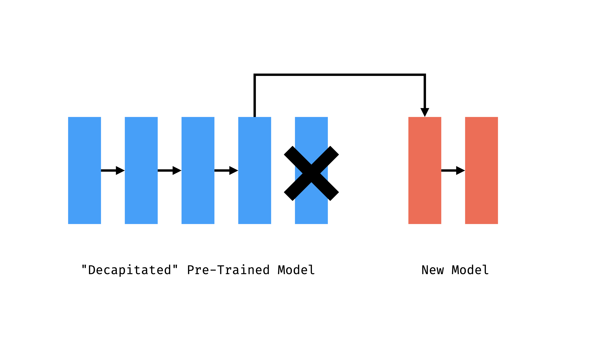

# K-Nearest Neighbors Classifier

## Structure

>"In pattern recognition, the k-nearest neighbors algorithm (k-NN) is a non-parametric method used for classification and regression.[1] In both cases, the input consists of the k closest training examples in the feature space." - Wikipedia

This class allows you to create a classifier using the K-Nearest Neighbors algorithm. It's a little different from other classes in this library, because it doesn't provide a model with weights, but rather a utility for constructing a KNN model using outputs from another model or any other data that could be classified.

For example, you could get features of an image by calling FeatureExtractor.infer(), and feed the features to KNNClassifier to classify an image.

mobilenet是预训练模型，

One of the advantages of doing KNN is that KNN classification, unlike the other feature extractor with transfer learning example that I went through previously. This requires no separate training step. The model is just the database of training images. And it is able to do that distance calculation in real time. So also, I can add labels later, I can add new images later. So you can kind of train and classify all ar the same time in a very flexible way. That is one of the advantage of doing it this KNN classification way.做KNN的一个好处是，KNN分类，不像我之前经历的其他带有迁移学习例子的特征提取器。这不需要单独的训练步骤。该模型只是训练图像的数据库。而且它能够实时地进行这种距离计算。因此，我也可以稍后添加标签，我可以稍后添加新的图像。所以你可以以一种非常灵活的方式同时进行训练和分类。这是采用KNN分类方法的优势之一。

We have looked at loading the MobileNet model, which is an image classification model trained on the ImageNet database. We are not using the classifications from that model, rather, we are taking the logics that layer before the last layer, before the softmax, before that probability is a sign. We are taking that. We are saving a lot of those logic, each paired with a label, and building up a big database. And then when we get new iamges, we think all of those images with their labels are in 1000 dimensional space. We get new images. It is somewhere in 1000 idmensional space. What collection of neighbors is it closest to? And which label is that? That is its label. We get that result, and we do something with it in with p5.

## 关于迁移学习Transfer learning和K-Nearnest Neighbors

迁移学习是将已经训练好的（打好标签并且学会特征）的数据集，比如MobilNet已经学会1000种物品，
的最后几层剥离，再附上新的模型。这样可以重新用更少的数据在原先训练好的模型基础上更快地得到新的模型。

